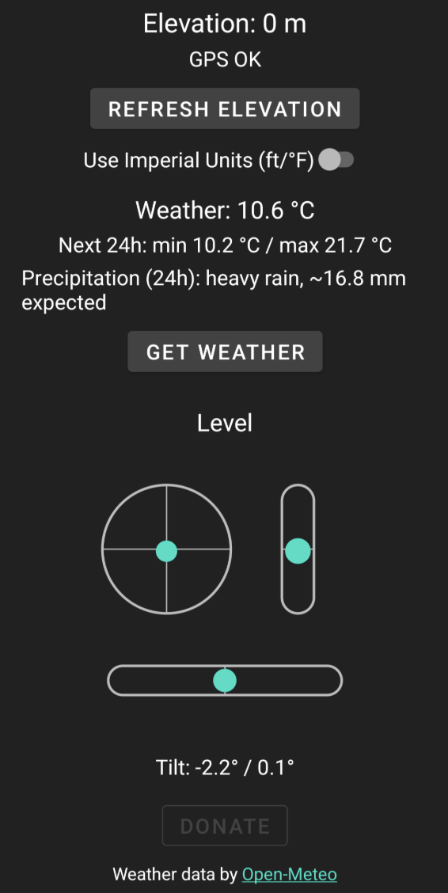

# CamperTools 🚐

**CamperTools** is a lightweight, ad-free Android utility app designed for RVers, campers, and van-lifers. It combines essential tools into a single, battery-friendly interface to help you park, level, and plan your stay.

## ✨ Features

*   **📏 Leveling Tool:** Precise 2-axis bubble level with visual guides. **Pitch & Roll** readout. **Dual-Axis Auto-calibrate** (Pitch & Roll in degrees) to offset your phone's camera bump or uneven surfaces.
*   **📐 Wheel Height Adjust:** Input your vehicle's dimensions to calculate the exact shim height needed for each wheel (**FL, FR, BL, BR**) to achieve a perfect level.
*   **🔦 Shake to Light:** Toggle the flashlight on/off simply by shaking your device (works even when using other tools in the app).
*   **🔴 Night Mode:** Full **red-light interface** across all screens (Settings, Weather, Level) to preserve your night vision.
*   **📖 In-App Guide:** Comprehensive manual explaining all features, available on first startup or anytime via Settings.
*   **🧭 Compass:** Smooth, filtered compass heading.
*   **🌤️ Weather Forecast:**
    *   Instant current conditions (Temp & Wind Speed/Direction).
    *   **Rolling 24-hour forecast** for temperature (min/max), wind gusts, and precipitation.
    *   **3-Day Forecast** (Daily highs/lows, precip, wind) in the \"More Data\" view.
    *   Powered by [Open-Meteo](https://open-meteo.com/).
*   **⚙️ Customization:** Toggle Imperial/Metric units, enable Night Mode, and calibrate sensors in the redesigned Settings menu.

## 📱 Screenshots



## 🛠️ Tech Stack

*   **Language:** Java
*   **Minimum SDK:** 21 (Android 5.0)
*   **Target SDK:** 35 (Android 15)
*   **Architecture:** Native Android Activity-based.
*   **APIs:**
    *   **Location:** Google Play Services (FusedLocationProvider) for accurate weather/elevation.
    *   **Weather:** Open-Meteo API (No API key required).
    *   **Sensors:** Accelerometer & Magnetometer (with low-pass filtering).

## 🚀 Getting Started

1.  **Clone the repository:**
    ```bash
    git clone https://github.com/becste/CamperTools.git
    ```
2.  **Open in Android Studio.**
3.  **Build and Run:**
    ```bash
    ./gradlew assembleDebug
    ```

## 🤝 Contributing

Contributions are welcome! Please feel free to submit a Pull Request.

## 📄 License

This project is licensed under the **Creative Commons Attribution-NonCommercial 4.0 International (CC BY-NC 4.0)**. 

This means you are free to:
*   **Share** — copy and redistribute the material in any medium or format.
*   **Adapt** — remix, transform, and build upon the material.

Under the following terms:
*   **Attribution** — You must give appropriate credit.
*   **NonCommercial** — You may **not** use the material for commercial purposes (you cannot sell this code or apps derived from it).

See the [LICENSE](LICENSE) file for details.

---
*Weather data provided by [Open-Meteo.com](https://open-meteo.com/)*
